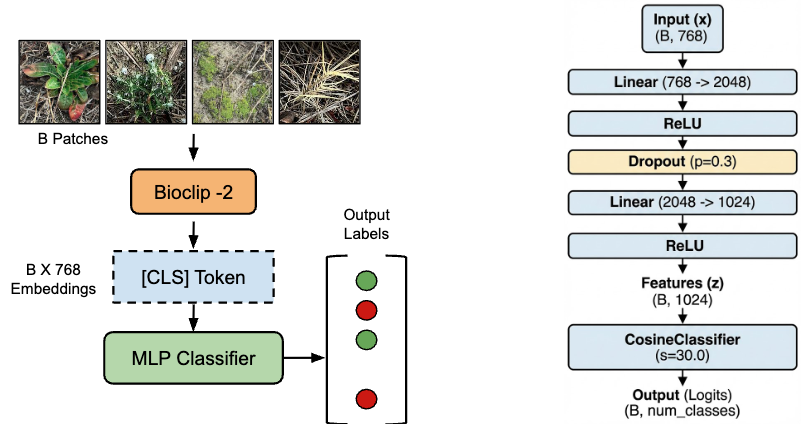
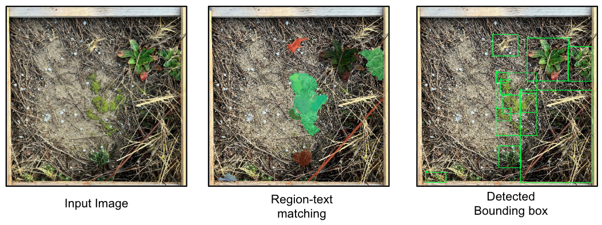

# plant-clef-2025


## Installation
```shell
conda create -n env_name python=3.10
conda activate env_name
pip install -r requirements.txt
```

## Feature Extraction
In this project, we used BioCLIP-2 feature extractor. 

Run the following command to Extract features from all training data.
```shell
python data/feature_extract_bioclip2.py
```

## Training Classifier

Run the following command to train the MLP classifier.
```shell
python src/train_mlp.py
```
Our trained model weight can be found in [This Link](https://drive.google.com/drive/folders/1FspoSKnjp56iVzfgGC4q13qSOe4KG4E4?usp=drive_link).

## Evaluation
First run `segment_bbox.py` to generate bounding boxes from all the test images using GroudingDINO model.

Then, Run the following command to get classification result using `BioCLIP-2 + GroundingDINO`.
```shell
python src/test_grid_sam.py
```
This will create .csv file containing all predicted class. Submit it to [Kaggle](https://www.kaggle.com/competitions/plantclef-2025/overview) Submission to get official score for evaluation.

## Test Examples
